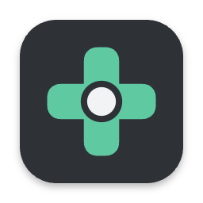
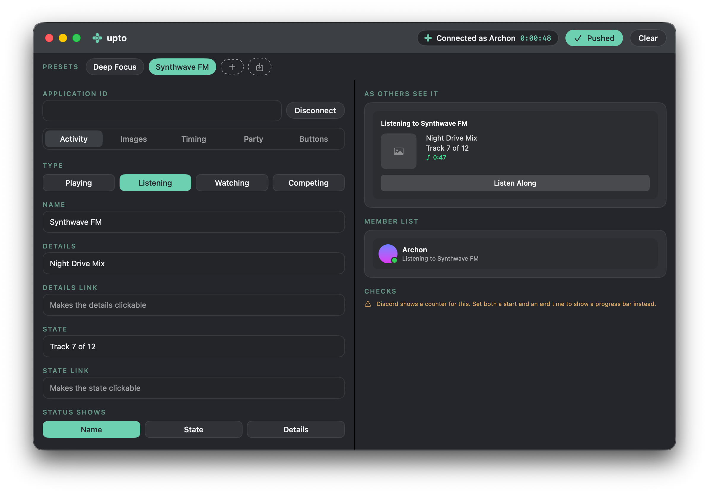
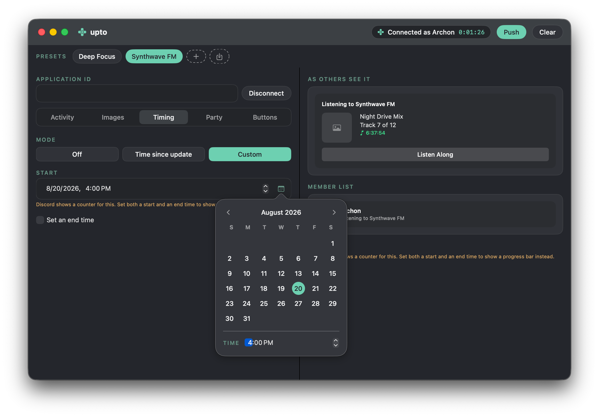
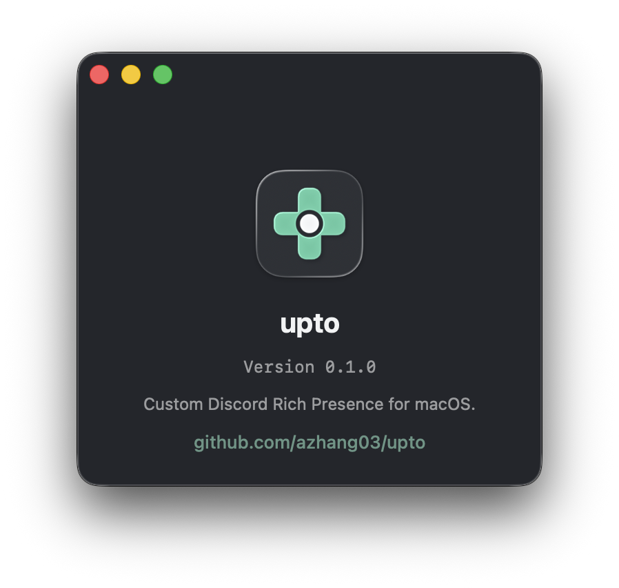

<h1>upto</h1>

<b>Custom Discord Rich Presence for the Mac.</b> 
A native SwiftUI app.

upto sets a custom Rich Presence on your Discord profile. You fill in the fields, press Push, and Discord shows your status. CustomRP for Windows inspired this project. upto is not a port. It is a new app made for the Mac, and it is in early development.

## Features

<table>
<tr>
<td width="50%">🎛️ <b>Full editor</b> Edit details, state, images with tooltips, timestamps, party size, and buttons.</td>
<td width="50%">👀 <b>Live preview</b> See the presence as Discord shows it, for every activity type.</td>
</tr>
<tr>
<td width="50%">📁 <b>Presets</b> Save setups, switch with one click, and share them as <code>.upto</code> files.</td>
<td width="50%">📍 <b>Menu bar</b> Start, stop, and switch presets without opening the window.</td>
</tr>
<tr>
<td width="50%">🚀 <b>Automation</b> Launch at login, connect on start, and reconnect when Discord restarts.</td>
<td width="50%">🧹 <b>Clean uninstall</b> One button in Settings removes the app and every file it made.</td>
</tr>
</table>

You can also override the app name that Discord displays. Support for Discord custom widgets is planned for a later phase.

## A closer look

<table>
<tr>
<td align="center"> Pick timestamps in the themed calendar.</td>
<td align="center"> The About window.</td>
</tr>
</table>

## Install

1. Download `upto-<version>.dmg` from the [Releases](https://github.com/azhang03/upto/releases) page.
2. Open the DMG.
3. Drag upto into the Applications folder. Do not run the app from inside the DMG window.
4. Open upto from Applications. macOS blocks the first launch because the app is not signed.
5. Open System Settings, then Privacy & Security. Scroll down and click "Open Anyway". Confirm the dialog.

You only do the last step once. Each release also has a zip file if you prefer that over a DMG.

## Build from source

You need macOS 14 or later and the Xcode Command Line Tools.

1. Clone the repository.
2. Run `./scripts/build-app.sh`.
3. Open `build/upto.app`.

An app you build yourself opens without the security prompt.

## License

MIT. See [LICENSE](LICENSE).
